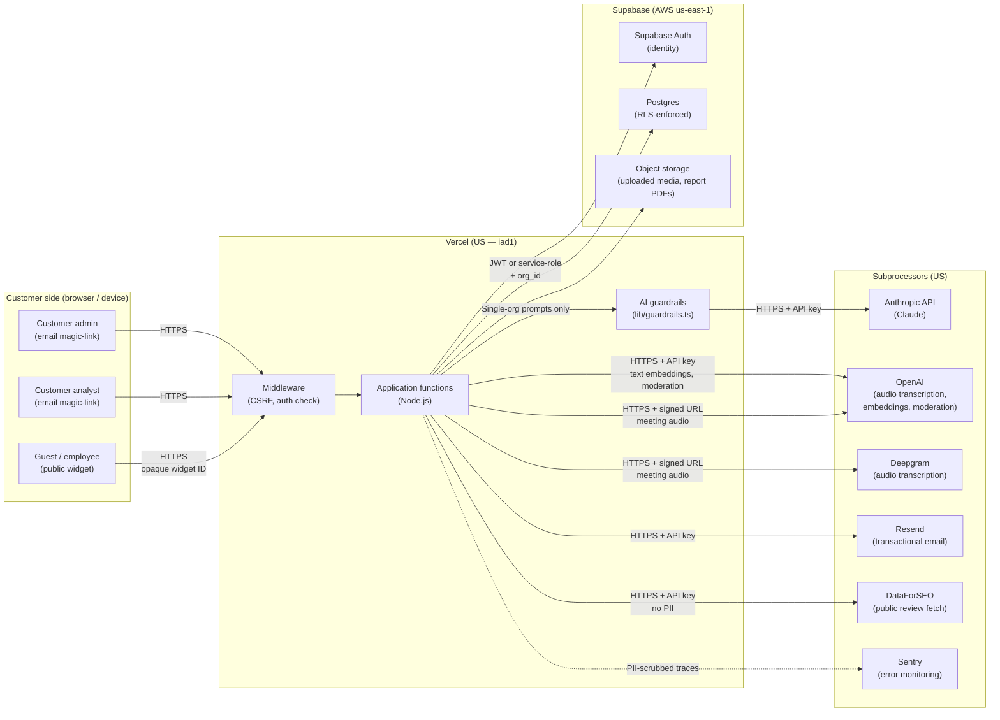

# Sentimetrx — Data Flow

_Last reviewed: 2026-05-16_

This document describes how customer data moves through the Sentimetrx
platform. It accompanies the buyer-facing security overview
(`docs/SECURITY_OVERVIEW.md`) and the filled CAIQ-Lite
(`docs/CAIQ_LITE.md`).

All processing and storage occurs in US data centers. No customer data
is transmitted outside the United States.

---

## 1. High-level diagram (Mermaid)

---

## 2. Actors

| Actor | How they reach the platform | Auth |
|---|---|---|
| **Customer admin** | Browser → `/admin/*` | Email magic-link (SSO is roadmap — see CAIQ IAM-06); CSRF on mutating routes |
| **Customer analyst** | Browser → `/analyze/*` | Same as admin, scoped to their org only |
| **Guest / employee** | Browser → `/s/[guid]`, `/b/[guid]`, `/pi/[guid]` | Opaque 122-bit identifier bound to the owning org. No cookie auth |
| **Internal operator (Datanautix)** | Browser → `/admin/*` | `requireAdmin` gate (admin-org membership + role) |

## 3. Storage locations

| What | Where | Region |
|---|---|---|
| Identity (email, password hash) | Supabase Auth | `us-east-1` |
| Tenant data (rows, responses, configs) | Supabase Postgres | `us-east-1` |
| Uploaded media & report PDFs (recordings, dataset uploads, logos) | Supabase Storage | `us-east-1` |
| Generated exports (PPTX decks, HTML shares) & nightly backups | AWS S3 | `us-east-1` |
| Audit log (`admin_action_log`) | Supabase Postgres (append-only) | `us-east-1` |
| Application code | Vercel | US (primarily `iad1`) |

## 4. Subprocessors data flows

| Subprocessor | Data sent | Purpose | Retained at subprocessor? |
|---|---|---|---|
| **Anthropic API** | Scoped, single-org prompts (feedback text + analysis context) | AI inference | Not used for model training (per Anthropic commercial API terms). Inputs and outputs retained by Anthropic for up to 30 days for trust & safety / abuse monitoring, then deleted (UserSafety classifier results may persist as labels). Zero Data Retention is an enterprise contractual upgrade; request is in progress with Anthropic. |
| **OpenAI** | **Town-hall meeting audio** (Whisper transcription), customer open-ended text (embeddings for vector search), social-comment text (Moderation) | Transcription / embeddings / toxicity scoring | ⚠️ Retention posture not yet confirmed; DPA not yet in place. OpenAI API data is not used for training by default, but audio/text retention must be confirmed contractually before a government deployment. |
| **Deepgram** | **Town-hall meeting audio** (via signed Storage URL) | Speech-to-text transcription + speaker diarization | ⚠️ Retention posture not yet confirmed; DPA not yet in place. Confirm audio retention before a government deployment. |
| **Azure OpenAI** | Text prompts (when the `azure-openai` provider is selected) | AI inference | Not used for training by default (Azure OpenAI terms). |
| **Resend** | Recipient email + transactional email body | Survey invitations & system email — only if customer enables outbound | Standard Resend retention |
| **DataForSEO** | Brand / location names + public review queries | Fetch of publicly available reviews | No customer PII sent |
| **Sentry** | Stack traces, request metadata | Error monitoring | PII fields scrubbed at boundary by `lib/sentryScrub.ts` (wired into client, server, and edge configs; unit-tested) |
| **AWS S3** | Generated exports (PPTX decks, HTML shares) + nightly org-data backups | Export object storage & disaster-recovery backups | Encrypted at rest |

## 5. AI inference flow (detail)

The AI flow is the most-asked-about path. Step-by-step:

1. **Caller** (a server-side route handler) gathers the rows needed
   for a specific user request — for example, "summarize themes for
   Org X, Brand Y, last 30 days."
2. **Tenant check.** All rows in the working set are confirmed to
   share a single `org_id` matching the caller's organization. A
   prompt that would mix data from two orgs is rejected before the
   model is invoked.
3. **Guardrails.** Free-text inputs run through `lib/guardrails.ts`:
   length limits, profanity, URL stripping where unsafe, and
   prompt-injection pattern detection.
4. **Prompt construction.** The system prompt is a fixed template;
   user-derived content is inserted into clearly delimited blocks.
   Tool definitions are narrow (no arbitrary SQL or HTTP).
5. **Inference call** to Anthropic API over HTTPS using a
   server-side-only API key. The model response is parsed against
   an expected schema.
6. **Output sanitization.** Model output rendered as HTML is passed
   through `isomorphic-dompurify` on rich-render surfaces before
   `dangerouslySetInnerHTML`.
7. **Persistence.** The structured output is stored in the customer's
   org-scoped tables. Token usage is logged for cost accounting.

## 6. Data-at-rest encryption

| Layer | Algorithm | Key management |
|---|---|---|
| Supabase Postgres | AES-256 | Supabase-managed (AWS KMS underneath) |
| Supabase Storage (uploaded media, PDFs) | AES-256 | AWS-managed (Supabase-operated) |
| AWS S3 (exports + backups) | AES-256 (SSE-S3; SSE-KMS if `BACKUP_S3_KMS_KEY_ID` set) | AWS-managed |

Application-layer encryption is additionally applied to
customer-supplied AI provider keys (AES-256-GCM envelope via
`lib/secretbox.ts`; the envelope key is held in Vercel environment
configuration). Other fields rely on the provider-managed
at-rest encryption above; field-level encryption of guest contact
data is on the hardening track.

## 7. Data-in-transit encryption

All external traffic is TLS 1.2+ (1.3 preferred). Internal Vercel ↔
Supabase traffic is over TLS within AWS regions. No customer data
traverses non-TLS channels.

## 8. Data lifecycle

1. **Ingest** — via UI upload, public widget submission, scheduled
   pull (DataForSEO), or email response capture (Resend webhook).
2. **Persistence** — into the customer's org-scoped Postgres tables.
3. **Processing** — analyst-triggered or scheduled jobs, all
   server-side, all org-scoped.
4. **AI enrichment** — single-org prompts to Anthropic; outputs
   stored back into the org's tables.
5. **Export** — customer-initiated exports (CSV, PPTX decks)
   delivered via signed URL or in-app download. Operator-initiated
   snapshot restores and cross-org transfers are logged in
   `admin_action_log`; per-export audit logging is on the
   hardening track.
6. **Retention** — per the contract; default 2 years for audit log,
   indefinite for live tenant data until org deletion request.
7. **Deletion** — full-org delete sweeps all org-tagged tables
   (fail-closed), Storage objects, and auth identities; row-level
   erasure honors data-subject requests with tombstone + redaction
   per the ratified policy (operator procedure today).

## 9. What never leaves the platform's primary boundary

- **Customer passwords / password hashes.** Never read by Sentimetrx
  application code; stored only inside Supabase Auth.
- **Guest emails captured by Sentimetrx-sent surveys.** Never
  included in AI prompts.
- **Cross-org data in a single prompt.** Single-org-per-prompt is
  the load-bearing AI invariant.
